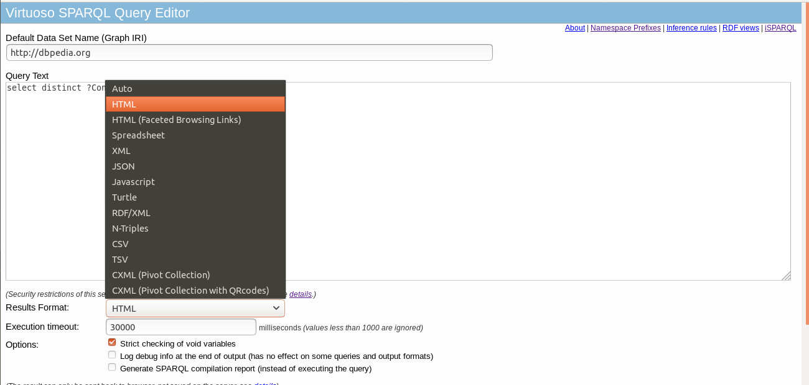

QApedia - Gerador de pares questão-sparql
===


[](https://dev.azure.com/qapedia/qapedia/_build/latest?definitionId=1&branchName=master)
[](https://codecov.io/gh/JessicaSousa/qapedia)
[](https://qapedia.readthedocs.io/pt/latest/?badge=latest)
[](https://github.com/JessicaSousa/qapedia/blob/master/LICENSE)


O módulo ``qapedia`` foi desenvolvido em python e realiza a geração de pares de
questões-sparql com base em um template previamente estabelecido. Para saber
mais sobre o funcionamento do pacote, você pode ler sobre ele na [documentação](https://qapedia.readthedocs.io/pt/latest/).


## Instalando


Caso deseje, você pode realizar a instalação do módulo do ``qapedia``,
primeiramente, dentro da pasta do projeto, você deverá instalar os
``requirements.txt`` caso não possua as bibliotecas necessárias para executar o
``qapedia``. Em seguida no diretório do qapedia você pode executar o
``pip install .``.

```console
    foo@bar:~/qapedia$ pip install -r requirements.txt
    foo@bar:~/qapedia$ pip install .
```

### Exemplo de uso


Ao acessar o link http://dbpedia.org/sparql, você é levado a seguinte tela do
Endpoint SPARQL Virtuoso. Alguns dos formatos dos resultados gerados através da
busca SPARQL estão mostrados na figura abaixo.




No ``qapedia``, o resultado de uma consulta pode ser obtido no formato json
nesse endpoint através da função
``qapedia.generator.get_results_of_generator_query``, no python ele é exibido
no formato dicionário, conforme mostrado no bloco de código a seguir.

```python
>>> from qapedia import generator
>>> template = {"question": "latitude de <A>",
...             "query": "select ?a where { <A> geo:lat ?a }",
...             "generator_query": "select distinct(?a) where"\
...             "{ ?a geo:lat [] }",
...             "variables": ["a"]}
>>> results = generator. get_results_of_generator_query(
...                         template["generator_query"],
...                         template["variables"],
...                         endpoint = "http://dbpedia.org/sparql")
>>> print(type(results))
<class 'dict'>
```
Com o resultado obtido em cima da ``generator_query``, a construção dos pares
questões-sparql podem ser realizados ao chamar a função
``qapedia.generator.extract_pairs``, o resultado será exibido como uma lista de
dicionários, onde cada um deles conterá as chaves ``question`` e ``sparql``.

```python
>>> from qapedia import generator
>>> template = {"question": "latitude de <A>",
...             "query": "select ?a where { <A> geo:lat ?a }",
...             "generator_query": "select distinct(?a) where"\
...             "{ ?a geo:lat [] }",
...             "variables": ["a"]}
>>> results = generator.get_results_of_generator_query(
...                     template["generator_query"],
...                     template["variables"],
...                     endpoint = "http://dbpedia.org/sparql")
>>> pairs = generator.extract_pairs(results["results"]["bindings"], template)
>>> len(pairs)
600
>>> "sparql" in pairs[0]
True
>>> "question" in pairs[0]
True
```