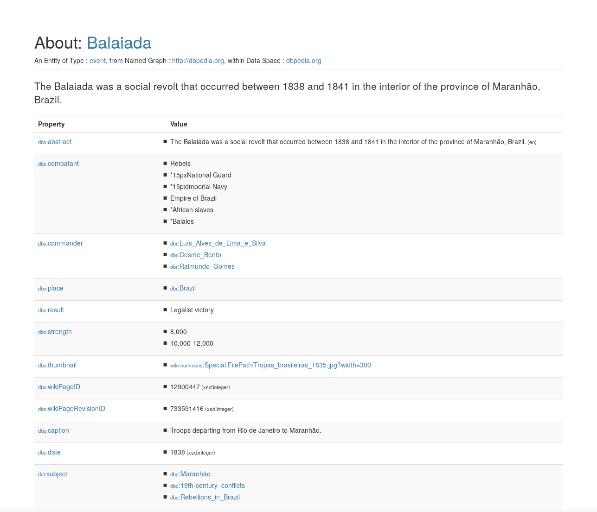

==========
Introdução
==========

O que é o QApedia?
------------------

**QApedia** ("QA" de Question-Answering, "pedia" de Wikipédia) é um pacote
escrito em python que tem como objetivo realizar a geração de pares de
questões-queries com base em um template previamente estabelecido sobre o
endpoint da DBpedia_. Esses pares gerados podem ser utilizado na criação de um
sistema de *Question-Answering (QA)*, onde a pergunta é fornecida em linguagem
natural e a sua resposta seria o resultado da consulta Sparql sobre a base de
dados da DBpedia.

DBpedia
'''''''

A **DBpedia** ("DB" de database) é um projeto criado pela comunidade que cria e
fornece acesso aos dados estruturados `extraídos da Wikipédia`_. Esses dados
possuem conexões de modo que consultas possam ser realizadas em cima da
Wikipédia similarmente a consultas realizadas em banco de dados, esses dados
também são conhecidos como *Linked Open Data*. Tim Berners-Lee listou quatro
princípios da *Linked Data* em sua nota `Linked Data`_, são eles:

1. Use `Uniform Resource Identifier`_ (URIs) para nomear para coisas
2. Use HTTP URIs para que as pessoas possam procurar esses nomes.
3. Quando alguém procura um URI, forneça informações úteis, usando os
   padrões (RDF*, SPARQL)
4. Inclua links para outros URIs. Para que eles possam descobrir mais
   coisas.

Na imagem a seguir é mostrada a página que representa uma entidade do tipo
evento, a entidade no caso é Balaiada_ que possui uma identificação URI,
além de um conjunto de informações agregadas, como o local onde ocorreu esse
evento (``dbo:place``) ou um breve resumo sobre esse evento (``dbo:abstract``).

Dados RDF
'''''''''

O `Resource Description Framework (RDF)`_ é um framework que serve para
expressar informações sobre recursos. Qualquer coisa pode ser considerada um
recurso, seja ela um conceito abstrato, documentos, pessoas ou objetos físicos,
por exemplo. O RDF permite realizar declarações sobre os recursos sempre
seguindo a seguinte estrutura:

|  <sujeito><predicado><objeto>

Através de uma instrução RDF, os recursos (sujeito e objeto) são relacionados
através de um predicado que representa a natureza desse relacionamento. Sendo
esse relacionamento direcional (do sujeito para o objeto) nomeado propriedade
em RDF. A seguir, um exemplo de triplas RDF representado em pseudocode do
recurso **Balaiada**.

|    <Balaiada> <é um> <evento>.
|    <Balaiada> <é a história das> <Forças Armadas Brasileiras>.
|    <Balaiada> <foi em> <1838>.
|    <Balaiada> <foi no> <Brasil>.
|    <Balaiada> <teve como resultado> <vitória legalista>

O conjunto de dados RDF da DBpedia é hospedado e publicado usando o `OpenLink
Virtuoso`_. Através da infraestrutura fornecida pelo Virtuoso é possível
acessar os dados RDF da DBpedia através do endpoint SPARQL usando GET padrão
de cliente WEB HTTP. Esse endpoint é utilizado na realização de buscas SPARQL
realizadas pelo pacote ``qapedia`` para recuperar esses dados da Wikipedia.

.. Links de Referências

.. _Uniform Resource Identifier: https://developer.mozilla.org/pt-BR/docs/Web/HTTP/Basico_sobre_HTTP/Identifying_resources_on_the_Web
.. _Linked Data: https://www.w3.org/DesignIssues/LinkedData.html
.. _extraídos da Wikipédia: https://wiki.dbpedia.org/about
.. _OpenLink Virtuoso: https://virtuoso.openlinksw.com/_
.. _DBpedia: https://wiki.dbpedia.org/
.. _Balaiada: https://dbpedia.org/page/Balaiada
.. _Resource Description Framework (RDF): https://www.w3.org/RDF/
