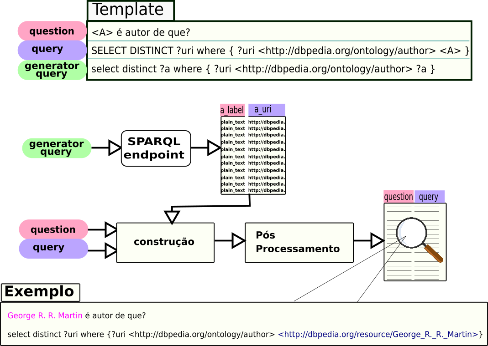

========
Tutorial
========

Introdução
----------

Necessita de um conjunto de questões-sparql? Com o *QApedia* vamos mostrar
como realizar essa tarefa de forma a ajudá-lo nesse problema de construção
desse dataset.

Este tutorial explica como funciona o processo de geração dos pares de
questão-sparql através do pacote *QApedia*. Explicando como o arquivo de
entrada deve estar estrutura até o resultado gerado.
Primeiramente vamos definir algumas informações importantes utilizadas nesse
documento.

* **SPARQL Endpoint** - URL onde é possível realizar consultas SPARQL com
  resultados via HTTP.
* **question** (pergunta) - pergunta em linguagem natural
* **query** - resposta da pergunta em formato de SPARQL
* **lacuna** (placeholder) - campo presente tanto na *pergunta* quanto na
  *query* configurando uma pergunta/query genérica.
* **generator query** (query geradora) - *query* que gera as possíveis opções
  que podem ser utilizadas para preencher as *lacunas*.
* **template** - Estrutura contendo os elementos *pergunta*, *query* e
  *generator query*
* **rdfs:label** - usada para fornecer uma versão legível do nome de um
  recurso.
* **URI** - Identificador de um recurso abstrato ou físico. Exemplos::

    http://dbpedia.org/resource/Hunter_%C3%97_Hunter
    https://pt.wikipedia.org/wiki/Hypertext_Transfer_Protocol
    https://qapedia.readthedocs.io/pt/latest/
* **Prefix** - São abreviações de URIs. São similares aos `imports` e
  `includes`, onde são definidas as abreviações utilizadas.
* **resource** (recurso) - são representados com URIs, e podem ser
  abreviados como nomes prefixados.

Uma consulta SPARQL geralmente pode ser representada da seguinte forma.
::

    # prefix declarations
    # nomeia uma URI de forma a abreviar
    PREFIX foo: <http://example.com/resources/>
    ...
    # dataset definition
    # Indica os grafos RDFS consultados
    FROM ...
    # result clause
    # Indica a informação a ser retornada da consulta
    SELECT ...
    # query pattern
    # Especifica o que consultar no conjunto de dados
    WHERE {
        ...
    }
    # query modifiers
    # reorganiza os dados da consulta
    # pode limitar a quantidade de resultados, reordenar, etc.
    ORDER BY ...

Na Figura abaixo temos o processo de geração do conjunto de pares de
questão-sparql, onde desejamos obter o formato de *pergunta* "Fulano é autor de
que?" e a *query* "select ?obra where {?obra tem_autor Fulano}". O
*placeholder* é definido no formato ``<LETRA>`` e está presente na *question*
e *query*.

A *generator_query* é utilizada para realizar uma consulta no endpoint
especificado e ajustada para retornar os campos de *rdfs:label* e a *URI* do
recurso autor. Com esse resultado, preenchemos as lacunas presente no template
e geramos pares similares ao exemplo mostrado. Nas próxima seção é mostrado
o guia de usuário contendo instruções de uso das funções do pacote. Alguns
`exemplos`_ estão disponíveis no repositório do QApedia.

.. _exemplos: https://github.com/QApedia/QApedia/tree/master/examples
